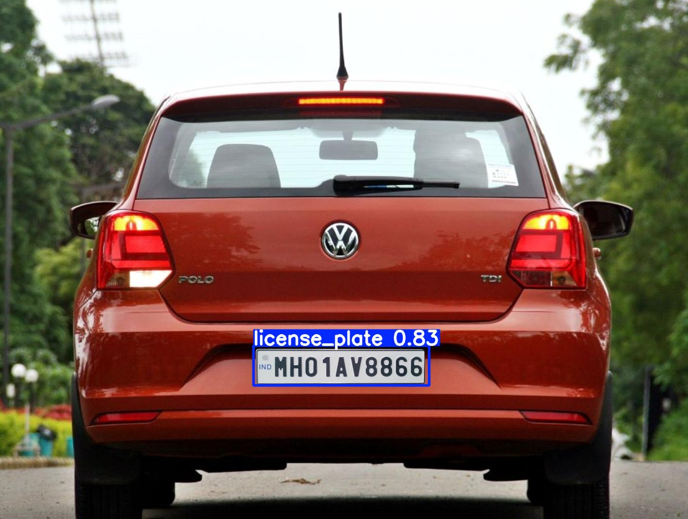

# 🚗 License Plate Recognition using YOLOv5 + EasyOCR

This project detects vehicle license plates using the YOLOv5 object detection model and extracts the plate numbers using Optical Character Recognition (OCR) with EasyOCR.

---

## 🔍 Features

- License plate detection using a custom-trained YOLOv5 model (`best.pt`)
- Text recognition from plates using EasyOCR
- Automatically saves cropped license plates and detects text
- Works on images of vehicles from various angles

---

## 🖼️ Sample Output

  

Detected Plate Number: `AP31BW1234`

---

## 🛠️ Tech Stack

- [YOLOv5](https://github.com/ultralytics/yolov5) (Custom trained)
- [EasyOCR](https://github.com/JaidedAI/EasyOCR)
- Python 3.8+
- OpenCV for image processing
